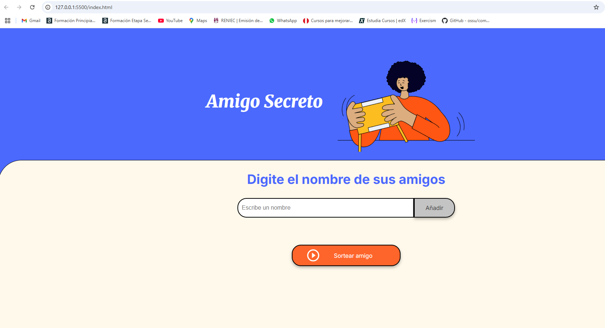
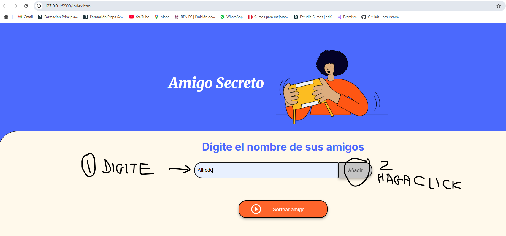
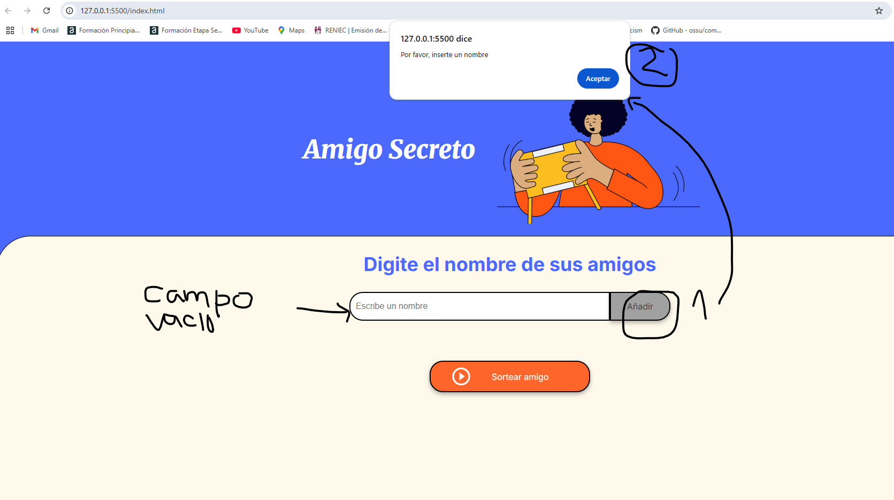
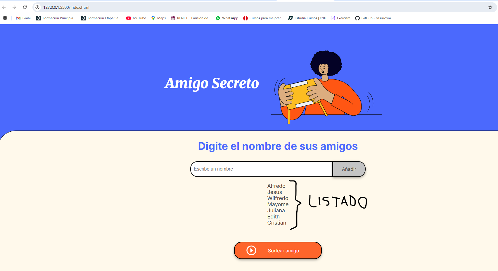
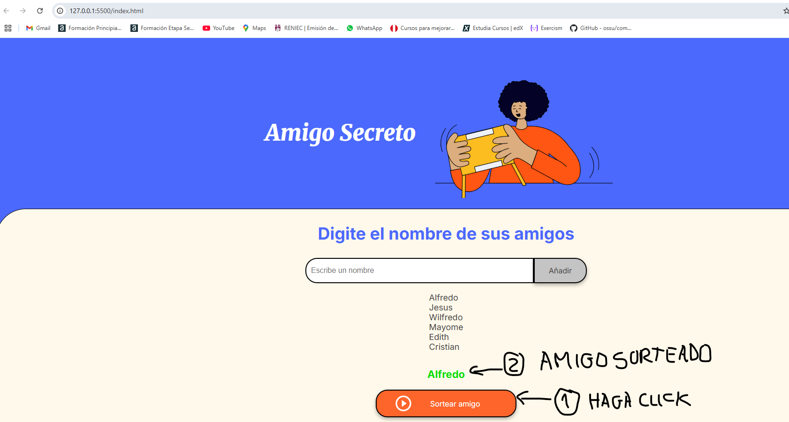

# Challenge Amigo Secreto
Consiste en una aplicación que permite a los usuarios ingresar nombres de amigos en una lista, realizar un sorteo aleatorio y determinar quién es el **"Amigo Secreto"**. 

## Aplicativo PRINCIPAL

## Funcionalidades ⚙️

- ✍️**Agregar nombres:** Los usuarios pueden ingresar nombres en un campo de texto y hacer clic en **"Añadir"** para agregarlos a la lista.

   

- ❗**Validación de entrada:** Si el campo de texto está vacío o contiene caracteres no válidos, el sistema mostrará una alerta solicitando un nombre válido.

   

- 👀**Visualización dinámica:** Los nombres ingresados aparecerán en una lista actualizada automáticamente debajo del campo de entrada.

   

- 🎲**Sorteo aleatorio:** Al hacer clic en el botón **"Sortear Amigo"**, el sistema seleccionará aleatoriamente un nombre de la lista y lo mostrará en pantalla.

   

  Comunícate con el **SOPORTE** al email:**najarrowil@gmail.com**
